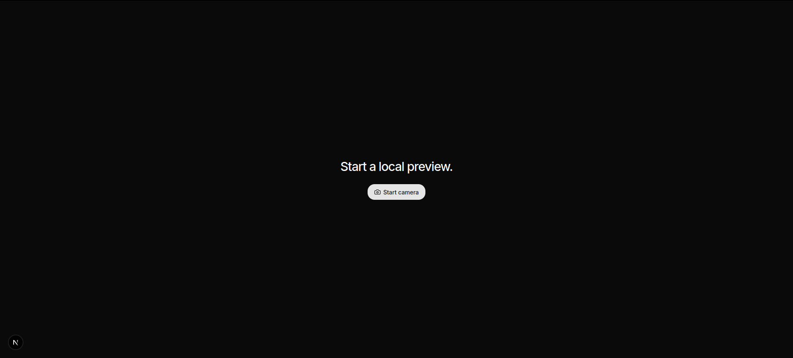

# Quick Glimpse

[Quick Glimpse](https://quick-glimpse.vercel.app) is a simple way to check how your camera looks before joining a video meeting.

It shows a live preview from a connected camera so you can confirm your framing and choose the right camera. Your video stays on your device.

## How to use it

1. Open [quick-glimpse.vercel.app](https://quick-glimpse.vercel.app).
2. Select **Start camera**.
3. Allow camera access when your browser asks.
4. Check your preview and use the camera menu to switch between connected cameras.
5. Select the expand button for a larger, focused preview.
6. Select the stop button when you are finished.

## If the camera does not start

- Make sure a camera is connected and not being used by another app.
- Allow camera access for Quick Glimpse in your browser's site settings, then try again.
- Use a browser that supports camera access.
